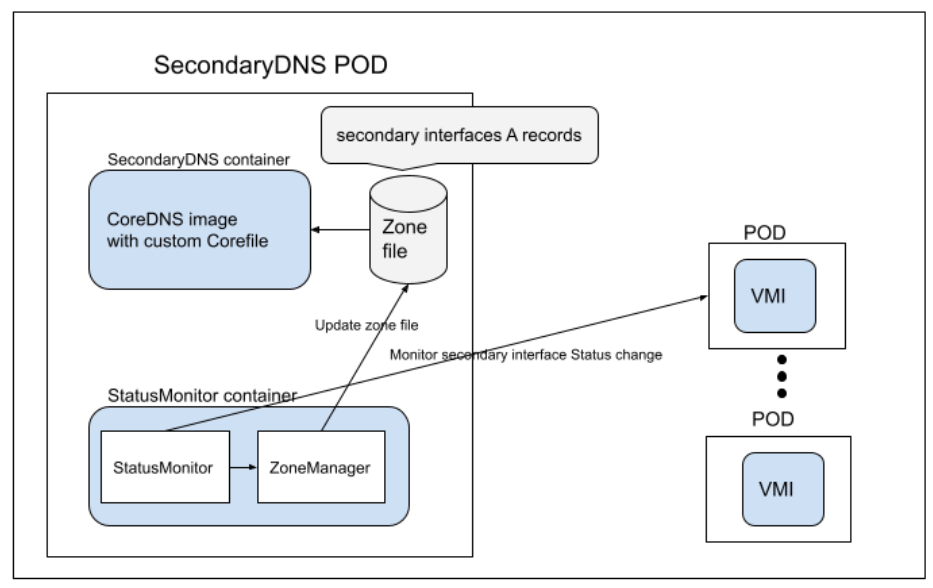

# KubeSecondaryDNS
DNS for KubeVirt VirtualMachines secondary interfaces

## Prerequisites
1. The KubeSecondaryDNS Deployment which listens on port 5353 should be reachable from outside the cluster.  
It can be exposed using NodePort, Load Balancer, Ingress or any other methodology.  
The IP to reach the KubeSecondaryDNS from outside the cluster would be called from now on  
"KubeSecondaryDNS public IP".
2. The secondary interfaces IPs must appear on the VMI status.  
For this, IPs should be either declared statically (i.e with CNI) or to have a guest agent installed.
3. Kubevirt must be installed, else the plugin would have an error.
4. If necessary, establish connectivity to KubeSecondaryDNS public IP via a relevant DNS entity that is used to
reach the authoritative KubeSecondaryDNS server, such as DNSResolver, TLD NameServer, etc.

When running KubeSecondaryDNS on top of kubevirtci, we achieve [1] as follows:
1. Create a NodePort for the KubeSecondaryDNS Deployment, use `31111` as the port.
2. Kubevirtci forwards all traffic from host `127.0.0.1:31111` to the kubevirtci container.
3. Traffic in the container, on port `31111` is forwarded to the control plane node of the cluster.

This way `nslookup -port=31111 <FQDN> 127.0.0.1` from outside the cluster can reach the secondary-dns container.

## Deployment
Choose the desired release from  
https://github.com/kubevirt/kubesecondarydns/releases
and apply its manifest.  
For example:
```shell
KSD_RELEASE=v0.0.5
URL=https://github.com/kubevirt/kubesecondarydns/releases/download/${KSD_RELEASE}/secondarydns.yaml
kubectl apply -f ${URL}
```

To undeploy it, use:
```shell
kubectl delete -f ${URL}
```

## Parameters
You can update those parameters in the manifest.

`DOMAIN` (default: `""`) - Determines the suffix of the FQDN.  
Can be used in order to differentiate between different clusters (by including the cluster name as part of it for example).  
The FQDN would look as follows:  
If `DOMAIN` is not empty `<interface_name>.<vm_name>.<namespace>.vm.<DOMAIN>`  
If `DOMAIN` is empty `<interface_name>.<vm_name>.<namespace>.vm`  

`NAME_SERVER_IP` (default: `""`) - KubeSecondaryDNS public IP
KubeSecondaryDNS zonefile will contain the following records based on `NAME_SERVER_IP` and `DOMAIN`:
```
IN NS ns.vm.<DOMAIN>.
ns IN A <NAME_SERVER_IP>
```

## Development

### Main operations
```shell
# run unit tests
make test

# bring up a local cluster with Kubernetes
make cluster-up

# build and deploy KubeSecondaryDNS
make cluster-sync

# run e2e tests on the cluster, requires cluster with KubeSecondaryDNS installed
make functest

# clean up all resources created by KubeSecondaryDNS from the cluster
make cluster-clean

# delete the cluster
make cluster-down
```

### Cluster access
```shell
# access kubernetes API on the cluster
./cluster/kubectl.sh get nodes

# ssh into the cluster's node
./cluster/cli.sh ssh node01
```

### Additional operations (done by cluster-sync)
```shell
# build image
make build

# push the image to the registry
make push

# deploy KubeSecondaryDNS manifest
make deploy

# create the node port
make create-nodeport
```

### Code related operations
```shell
# perform auto-formatting on the source code (if not done by your IDE)
make fmt

# run go vet
make vet

# update go dependencies
make vendor
```

### Mapping a container image to the code
In order to know which git commit hash was used to build a certain container image perform the following steps:
```shell
podman inspect --format '{{ index .Config.Labels "multi.GIT_SHA"}}' <IMAGE>
```
Note that it can also be inspected by skopeo without downloading the image.

## Basic example

Deploy the following manifest and wait until the IP is reported on the VMI status,  
and that the plugin refreshes its database (1-2 minutes).

Resolve the FQDN using this command:  
`nslookup -port=31111 nic1.vmi-sec.secondary-test.vm 127.0.0.1`  
Note: In this example `DOMAIN` is an empty string.

Expected output:
```
Server:		127.0.0.1
Address:	127.0.0.1#31111

Name:	nic1.vmi-sec.secondary-test.vm
Address: 10.10.0.5
```

Manifests:
```
---
apiVersion: v1
kind: Namespace
metadata:
  name: secondary-test
---
apiVersion: k8s.cni.cncf.io/v1
kind: NetworkAttachmentDefinition
metadata:
  name: ptp-conf
  namespace: secondary-test
spec:
  config: '{
      "cniVersion": "0.3.1",
      "name": "mynet",
      "plugins": [
        {
          "type": "ptp",
          "ipam": {
            "type": "static",
            "addresses": [
                {
                  "address": "10.10.0.5/24",
                  "gateway": "10.10.0.254"
                }
            ]
          }
        }
      ]
    }'
---
apiVersion: kubevirt.io/v1
kind: VirtualMachineInstance
metadata:
  name: vmi-sec
  namespace: secondary-test
spec:
  domain:
    devices:
      disks:
      - disk:
          bus: virtio
        name: containerdisk
      - disk:
          bus: virtio
        name: cloudinitdisk
      interfaces:
      - bridge: {}
        name: nic1
    resources:
      requests:
        memory: 128Mi
  networks:
  - multus:
      networkName: ptp-conf
    name: nic1
  volumes:
  - containerDisk:
      image: quay.io/kubevirt/cirros-container-disk-demo:devel
      imagePullPolicy: Always
    name: containerdisk
  - cloudInitNoCloud:
      userData: |
        #!/bin/sh
        echo 'printed from cloud-init userdata'
    name: cloudinitdisk
```

## High level design



The KubeSecondaryDNS Deployment consists of two containers:
1. CoreDNS (https://coredns.io)
2. StatusMonitor container (includes ZoneManager module).

StatusMonitor is watching VMI status changes via k8s API,
and sending the info to the ZoneManager about the secondary interfaces.
The ZoneManager builds the Zone File that the CoreDNS expects according to the received status.

The Zone File consists of:
1. SOA header (DNS parameters)
2. List of FQDN and associated IP addresses.

ZoneManager updates the `/zones` folder which is shared between the containers, with the updated data.  
CoreDNS monitors the `/zones` folder, and updates its DB accordingly (using CoreDNS `auto` plugin).  
This way the CoreDNS can serve secondary interfaces DNS queries.
